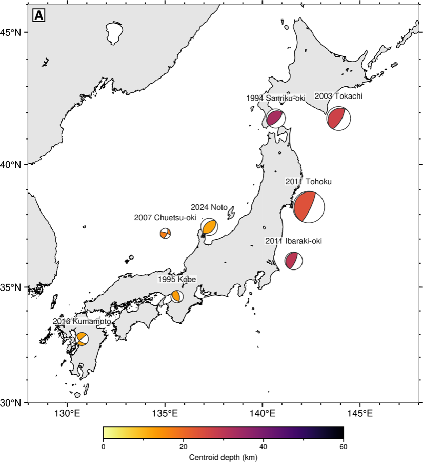
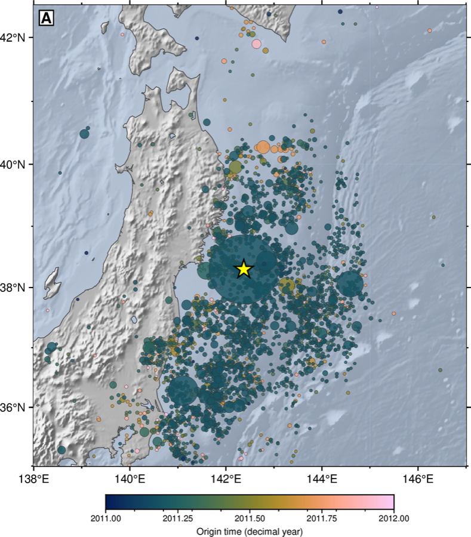
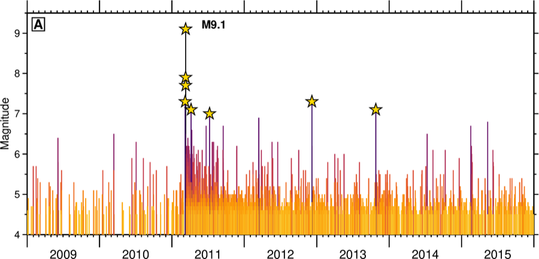
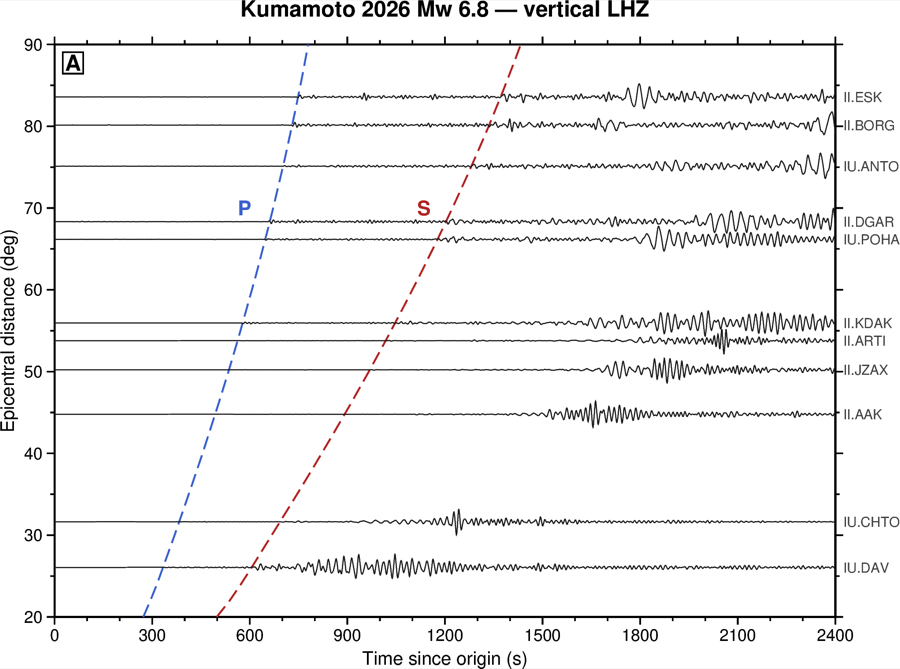
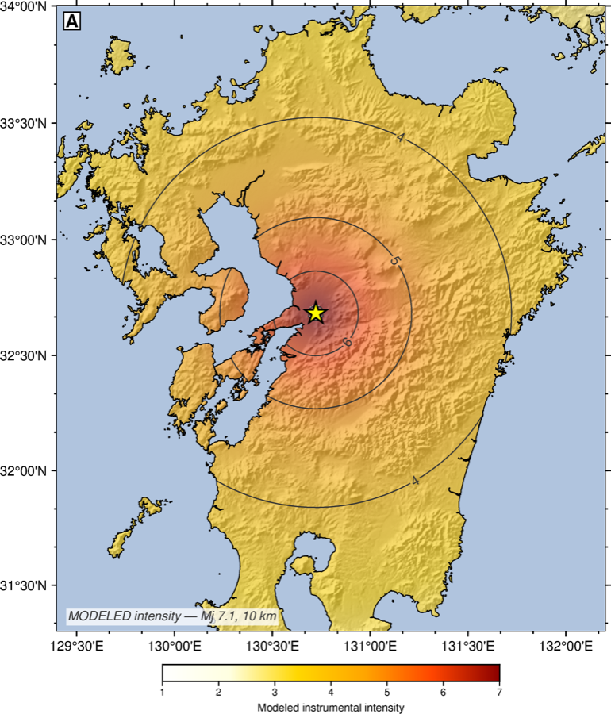

# pygmt-plotting

[](LICENSE)
[](https://www.pygmt.org)
[](https://www.generic-mapping-tools.org)
[](https://agentskills.io/specification)

An [Agent Skill](https://agentskills.io/specification) that turns [PyGMT](https://www.pygmt.org)
into a figure production line: copy a template, edit one CONFIG block, pick a style,
ship a publication-ready map.

<p align="center"></p>
<p align="center"><i>2026 Mj 7.1 Kumamoto earthquake: Sentinel-1 T163 coseismic
interferogram (16 → 28 Jul 2026), rendered with this skill's house style — cyclic CPT,
nearest-neighbor guard, GEM fault traces, 2016 Mw 7.0 (white) and 2026 (yellow) epicenters.</i></p>

## Features

- **Fourteen runnable templates.** The full seismology set of the GMT China community
  gallery (catalog map, depth section, beachballs, M-T, time-colored epicenters, waveform
  record section, shaking intensity, station geometry, Earth interior, 3D slip fence) plus
  InSAR/geodesy staples (displacement, wrapped interferogram, GPS velocities, E/N/U panels).
  Each runs standalone; you edit only the CONFIG block and the data section.
- **Six styles, one switch.** `house` · `journal` · `classic` · `minimal` ·
  `presentation` · `dark` — `STYLE = "dark"` restyles the entire figure.
- **Condensed reference + symptom-indexed gotchas.** The failures that cost an afternoon
  because nothing errors out, each with symptom → cause → fix.
- **Pre-delivery QC checklist.** Overlap, clipping, missing arrowheads, wrong data anchors.
  Every checklist item and gotcha corresponds to a failure observed in testing.

## Installation

Clone into your agent's skills directory (target folder must be named `pygmt-plotting`):

```bash
# Claude Code
git clone https://github.com/rookieplayerjr/pygmt-plotting-skill.git ~/.claude/skills/pygmt-plotting
# Codex ($CODEX_HOME/skills if set)
git clone https://github.com/rookieplayerjr/pygmt-plotting-skill.git ~/.codex/skills/pygmt-plotting
# Tencent WorkBuddy
git clone https://github.com/rookieplayerjr/pygmt-plotting-skill.git ~/.workbuddy/skills/pygmt-plotting
```

The skill is discovered automatically from `SKILL.md`; start a new session afterwards.
Rendering requires PyGMT/GMT (`conda install -c conda-forge pygmt`); `record_section.py`
additionally needs obspy. The reference material is useful without them.

## Templates

The template set mirrors the seismology section of the
[GMT China community gallery](https://docs.gmt-china.org/latest/gallery/),
re-implemented in PyGMT. Figures are real data: the bundled USGS Japan-trench
catalog (public domain), bundled EarthScope waveforms, or GCMT-approximate
mechanisms — the shaking map is a clearly-labeled model field:

| | |
|---|---|
|  |  |
| `seismicity_map.py` — depth-colored, magnitude-sized catalog with magnitude-class count panel | `cross_section.py` — trench-perpendicular section: the Wadati-Benioff zone, depth positive-down |
|  |  |
| `focal_mechanisms.py` — notable-event beachballs, manual Mw sizing, depth CPT | `time_colored_seismicity.py` — origin-time-colored epicenters (sequence migration) |
|  |  |
| `mt_plot.py` — magnitude-time bars on a datetime axis, mainshocks starred | `record_section.py` — real IU/II LHZ traces of the 2026 Kumamoto quake with TauP P/S curves |
|  |  |
| `shaking_intensity.py` — ShakeMap-style modeled intensity around a real epicenter | `station_azimuthal_map.py` — azimuthal-equidistant geometry with distance rings |

Non-seismology templates (`displacement_map.py`, `velocity_field_map.py`,
`wrapped_phase_map.py`, `multipanel_components.py`, `fault_slip_3d.py`) remain in
`scripts/` and run standalone.

## Community-adapted showpieces

| | |
|---|---|
|  |  |
| `earth_interior.py` — Earth shells to scale with PcP / PKiKP ray chords (polar projection; GMT-China gallery ex002 pattern) | Sagaing along-track offsets draped on 3D terrain with `grdview` (`drapegrid` technique of gallery ex029) |

## Documentation

| File | Contents |
|---|---|
| `SKILL.md` | Entry point: template & style routing, house rules, the mandatory QC loop |
| `REFERENCE.md` | Condensed PyGMT API (verified against 0.17.0) + publication craft |
| `GOTCHAS.md` | Symptom-indexed pitfalls: region/CPT/grids/layout/meca/velo/vectors |
| `GALLERY.md` | 13 ready-to-adapt scenario snippets |
| `COMMUNITY.md` | Curated navigation of the GMT China community manual, incl. CJK labels |
| `MANUAL.html` | Self-contained handbook (Chinese) covering all of the above |

## A sample of the gotchas

- `frame=["WSne", "af", "+tTitle"]` hard-fails on GMT 6.6 — frame settings may appear in
  only one list entry: `["WSne+tTitle", "af"]`.
- `velo` with `+n` silently deletes every arrowhead on geographic maps. Omit `+n`; size
  `VSCALE` so the smallest meaningful velocity clears the head length.
- Bilinear interpolation destroys cyclic colormaps: ±π pixels average to the neutral
  color and wrapped interferograms grow a false gray seam. Use `interpolation="n"`.
- `makecpt` without `output=` sets a session-global CPT that the next `makecpt` silently
  overwrites — multi-panel figures get cross-contaminated colors.
- Scatter fed straight to `xyz2grd` renders vertical stripes; it bins, it does not
  interpolate. Use `blockmean` + `surface`.

## Acknowledgements

The community-sourced material references the [GMT China community manual](https://docs.gmt-china.org)
(CC BY-NC-SA); `fault_slip_3d.py` and `station_azimuthal_map.py` are PyGMT re-implementations
of the plotting patterns in their gallery ex030 and ex011. Colormaps follow Crameri's
[Scientific Colour Maps](https://www.fabiocrameri.ch/colourmaps/).

## License

MIT — see [LICENSE](LICENSE).
