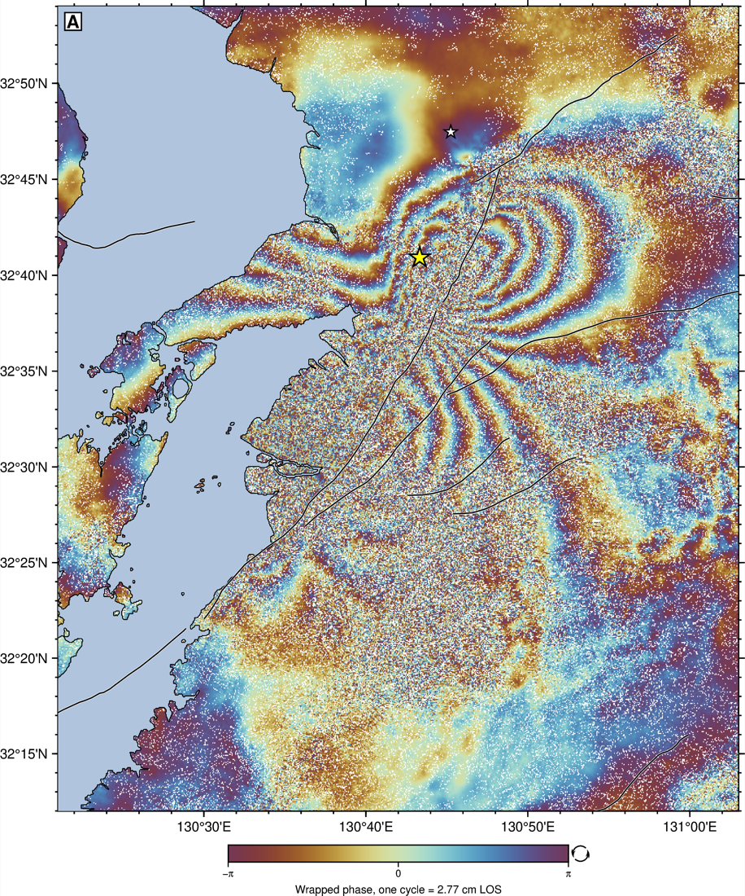
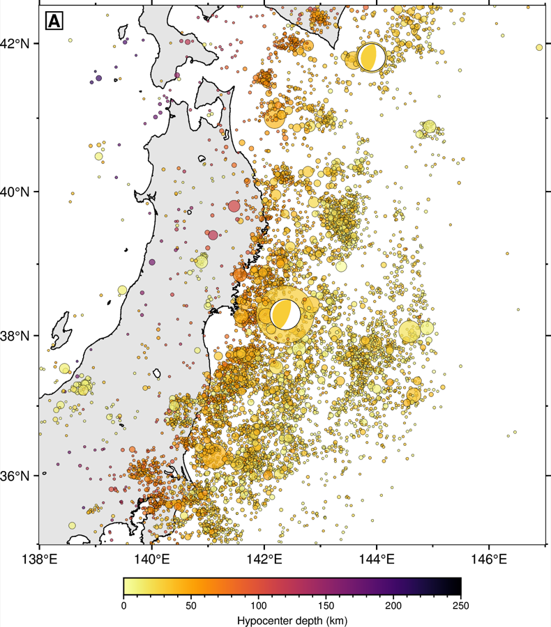
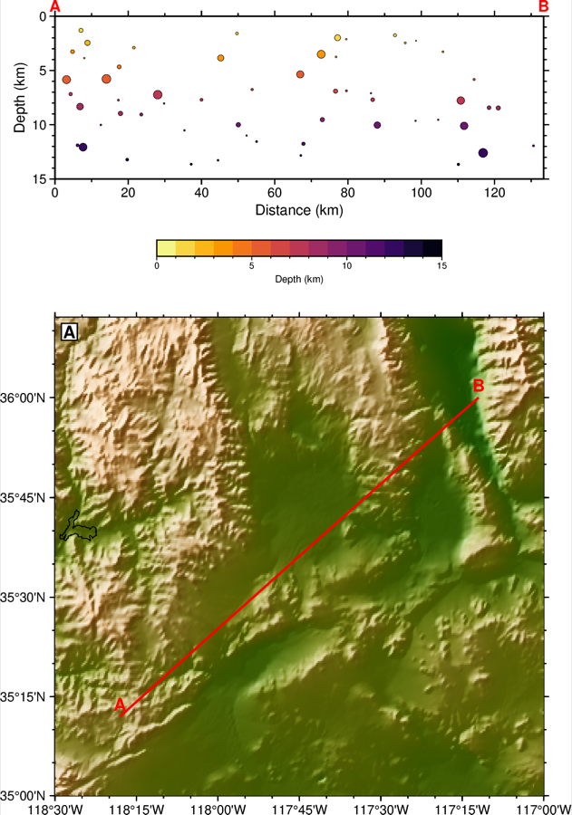
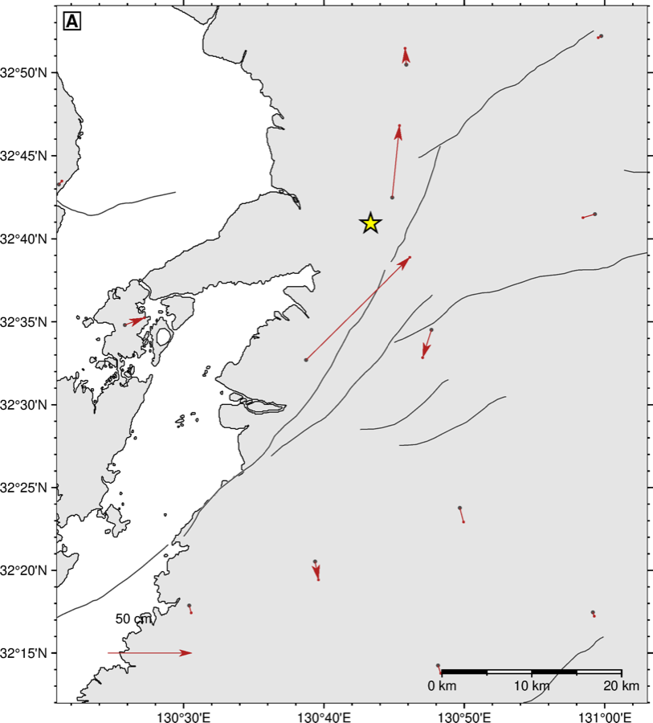
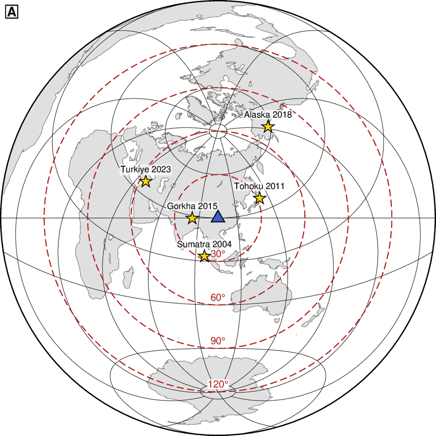
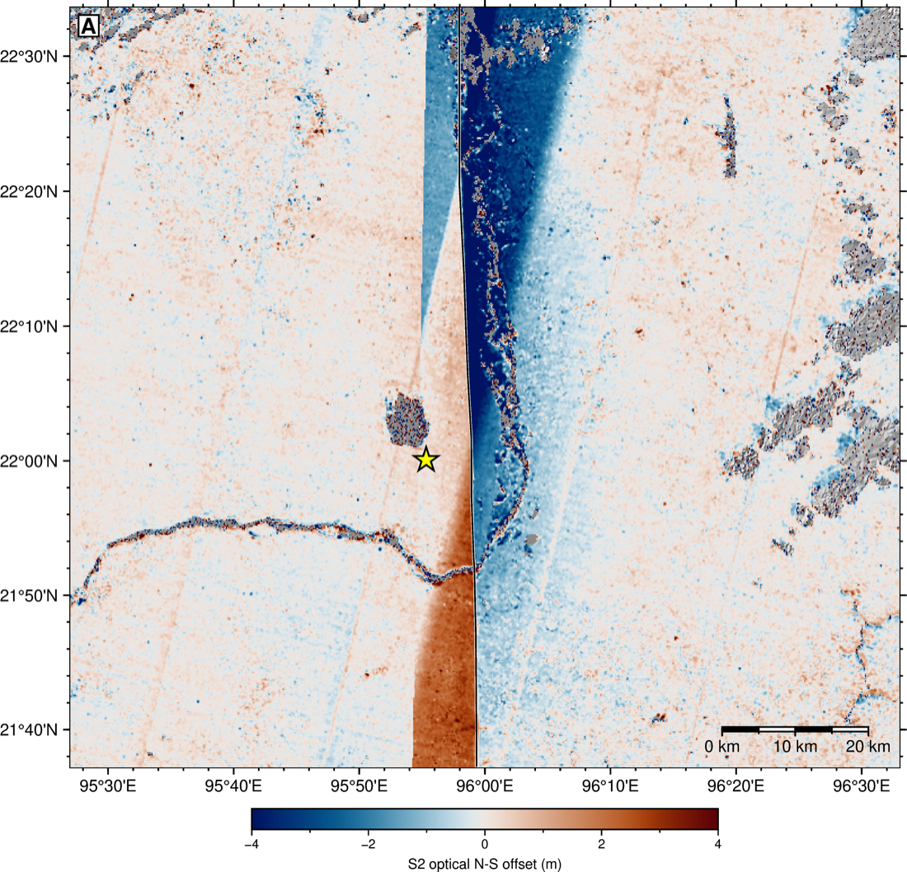
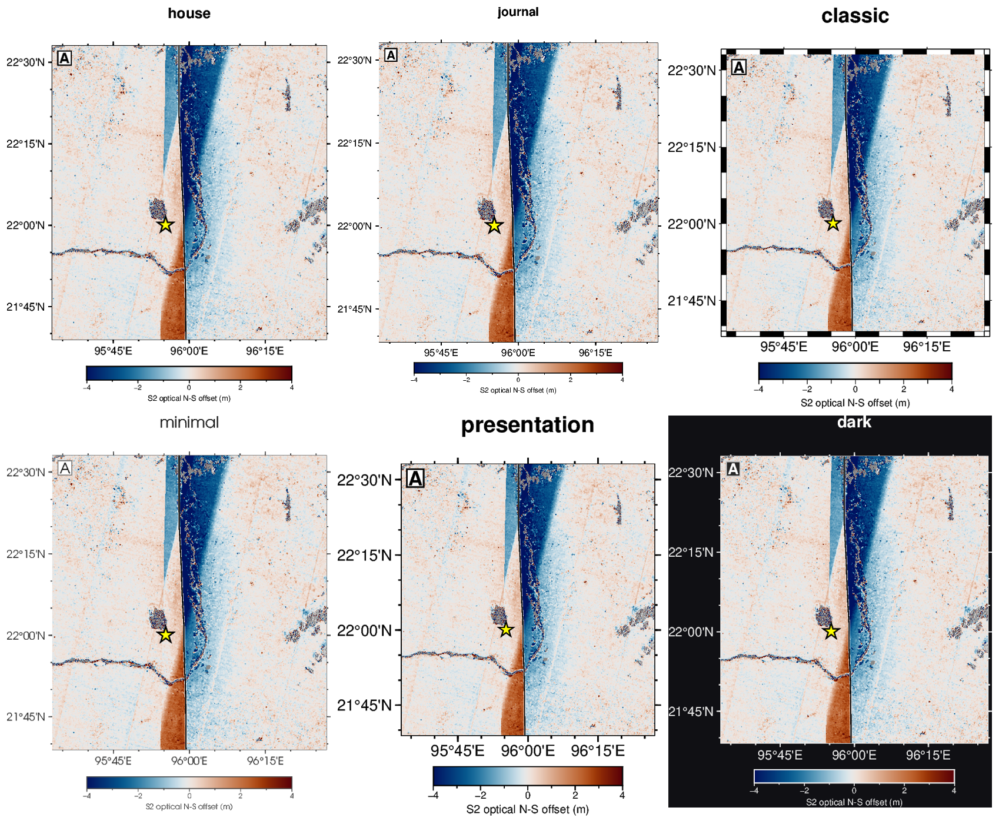
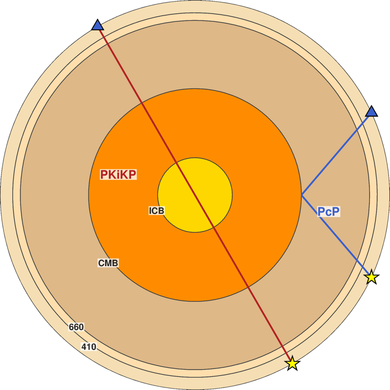
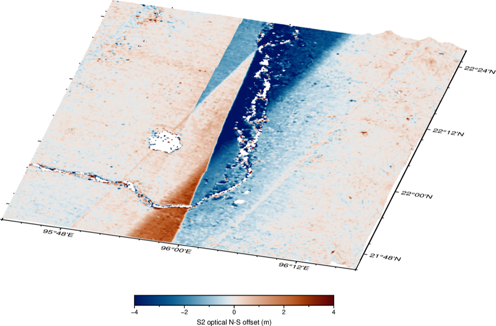

# pygmt-plotting

[](LICENSE)
[](https://www.pygmt.org)
[](https://www.generic-mapping-tools.org)
[](https://agentskills.io/specification)

An [Agent Skill](https://agentskills.io/specification) that turns [PyGMT](https://www.pygmt.org)
into a figure production line: copy a template, edit one CONFIG block, pick a style,
ship a publication-ready map.

<p align="center"></p>
<p align="center"><i>2026 Mj 7.1 Kumamoto earthquake: Sentinel-1 T163 coseismic
interferogram (16 → 28 Jul 2026), rendered with this skill's house style — cyclic CPT,
nearest-neighbor guard, GEM fault traces, 2016 Mw 7.0 (white) and 2026 (yellow) epicenters.</i></p>

## Features

- **Nine runnable templates.** Displacement map, seismicity map with focal mechanisms,
  map + depth section, E/N/U component panels, GPS velocity field, wrapped interferogram,
  3D finite-fault slip fence, station-centered teleseismic geometry. Each runs standalone
  in seconds (two on a bundled real USGS catalog); you edit only the CONFIG block and the
  data section.
- **Six styles, one switch.** `house` · `journal` · `classic` · `minimal` ·
  `presentation` · `dark` — `STYLE = "dark"` restyles the entire figure.
- **Condensed reference + symptom-indexed gotchas.** The failures that cost an afternoon
  because nothing errors out, each with symptom → cause → fix.
- **Pre-delivery QC checklist.** Overlap, clipping, missing arrowheads, wrong data anchors.
  Every checklist item and gotcha corresponds to a failure observed in testing.

## Installation

Clone into your agent's skills directory (target folder must be named `pygmt-plotting`):

```bash
# Claude Code
git clone https://github.com/rookieplayerjr/pygmt-plotting-skill.git ~/.claude/skills/pygmt-plotting
# Codex ($CODEX_HOME/skills if set)
git clone https://github.com/rookieplayerjr/pygmt-plotting-skill.git ~/.codex/skills/pygmt-plotting
# Tencent WorkBuddy
git clone https://github.com/rookieplayerjr/pygmt-plotting-skill.git ~/.workbuddy/skills/pygmt-plotting
```

The skill is discovered automatically from `SKILL.md`; start a new session afterwards.
Rendering requires PyGMT/GMT (`conda install -c conda-forge pygmt`); the reference material
is useful without them.

## Templates

Nine runnable templates; every figure below is real data — the bundled USGS
Japan-trench catalog (public domain, `scripts/data/japan_trench_usgs.csv`) or
Sentinel-1/GEONET products of the 2026 Mj 7.1 Kumamoto earthquake:

| | |
|---|---|
|  |  |
| `seismicity_map.py` — USGS Tohoku catalog (7 708 events, M ≥ 4.5), depth-colored, magnitude-sized; the 2011 Mw 9.1 thrust mechanism stands out at scale | `cross_section.py` — the same catalog projected on a trench-perpendicular section: the Wadati-Benioff zone dips west off the profile, depth reading positive down |
|  |  |
| `velocity_field_map.py` conventions on real GEONET coseismic offsets of the 2026 Kumamoto earthquake (87 cm peak, arrows ≥ 2 cm, all stations dotted) | `station_azimuthal_map.py` — azimuthal-equidistant teleseismic geometry with epicentral-distance rings; the six labeled epicenters are real events |

Templates without a figure here (`displacement_map.py`, `multipanel_components.py`,
`wrapped_phase_map.py`, `fault_slip_3d.py`) run standalone on synthetic demo fields —
their real-data counterparts are the Kumamoto figures on this page.

## Real-data example

<p align="center"></p>

The 2025 Mw 7.7 Sagaing (Myanmar) earthquake in Sentinel-2 optical image
correlation: N-S offsets from two destriped tile mosaics, `displacement_map.py`
conventions — diverging `vik` centered at zero, decorrelated pixels transparent
over shaded relief. The ±4 m antisymmetry across the razor-sharp trace is the
right-lateral rupture; the star is the USGS epicenter.

## Styles

<p align="center"></p>

Same data — the real Sagaing S2 offset field — six looks; set
`STYLE = "..."` in any template. All styles keep the same hard
rules (annotations on W/S only, bottom colorbar with units, depth axes positive-down).
`style_presets.py` also exposes `style()`, `panel_label()`, `colorbar()`, `coast_colors()`
for standalone scripts.

## Community-adapted showpieces

| | |
|---|---|
|  |  |
| `earth_interior.py` — Earth shells to scale with PcP / PKiKP ray chords (polar projection; GMT-China gallery ex002 pattern) | Sagaing N-S offsets draped on 3D terrain with `grdview` (`drapegrid` technique of gallery ex029) |

## Documentation

| File | Contents |
|---|---|
| `SKILL.md` | Entry point: template routing, style routing, house rules, load discipline |
| `REFERENCE.md` | Condensed PyGMT API (verified against 0.17.0) |
| `GOTCHAS.md` | Symptom-indexed pitfalls: region/CPT/grids/layout/meca/velo/vectors |
| `GALLERY.md` | 13 ready-to-adapt scenario snippets |
| `STYLES.md` | The six styles: configs, previews, dark-mode notes, how to extend |
| `CRAFT.md` | Publication craft: layer order, colormaps, hillshade, export |
| `QC.md` | Pre-delivery checklist loop with a token-economy protocol |
| `COMMUNITY.md` | Curated navigation of the GMT China community manual, incl. CJK labels |
| `MANUAL.html` | Self-contained handbook (Chinese) covering all of the above |

## A sample of the gotchas

- `frame=["WSne", "af", "+tTitle"]` hard-fails on GMT 6.6 — frame settings may appear in
  only one list entry: `["WSne+tTitle", "af"]`.
- `velo` with `+n` silently deletes every arrowhead on geographic maps. Omit `+n`; size
  `VSCALE` so the smallest meaningful velocity clears the head length.
- Bilinear interpolation destroys cyclic colormaps: ±π pixels average to the neutral
  color and wrapped interferograms grow a false gray seam. Use `interpolation="n"`.
- `makecpt` without `output=` sets a session-global CPT that the next `makecpt` silently
  overwrites — multi-panel figures get cross-contaminated colors.
- Scatter fed straight to `xyz2grd` renders vertical stripes; it bins, it does not
  interpolate. Use `blockmean` + `surface`.

## Acknowledgements

The community-sourced material references the [GMT China community manual](https://docs.gmt-china.org)
(CC BY-NC-SA); `fault_slip_3d.py` and `station_azimuthal_map.py` are PyGMT re-implementations
of the plotting patterns in their gallery ex030 and ex011. Colormaps follow Crameri's
[Scientific Colour Maps](https://www.fabiocrameri.ch/colourmaps/).

## License

MIT — see [LICENSE](LICENSE).
