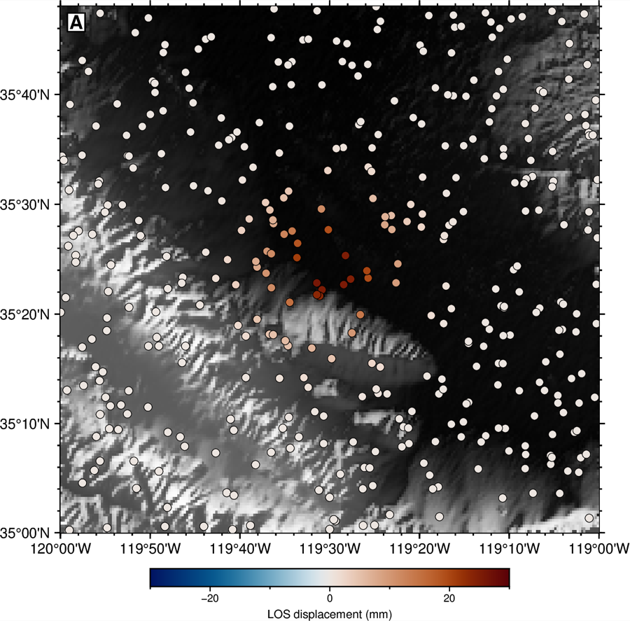
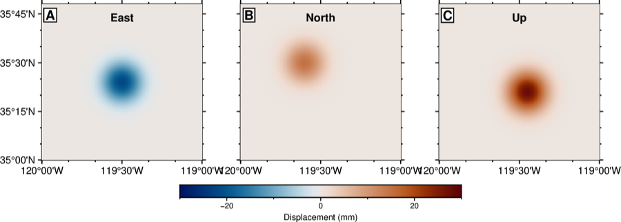
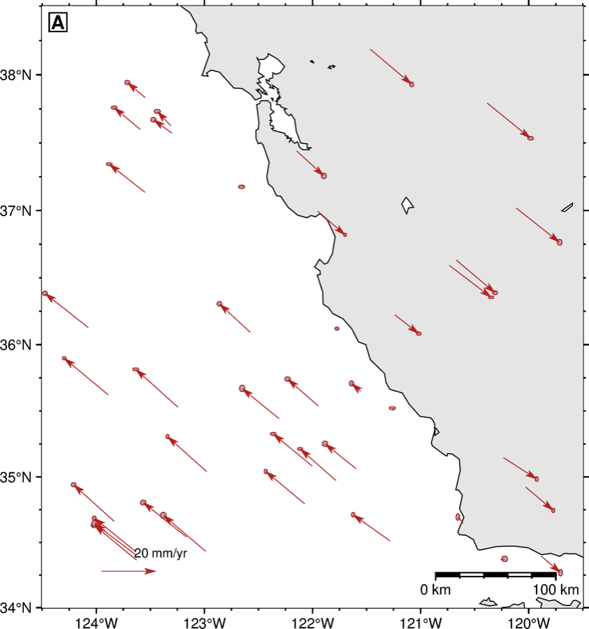
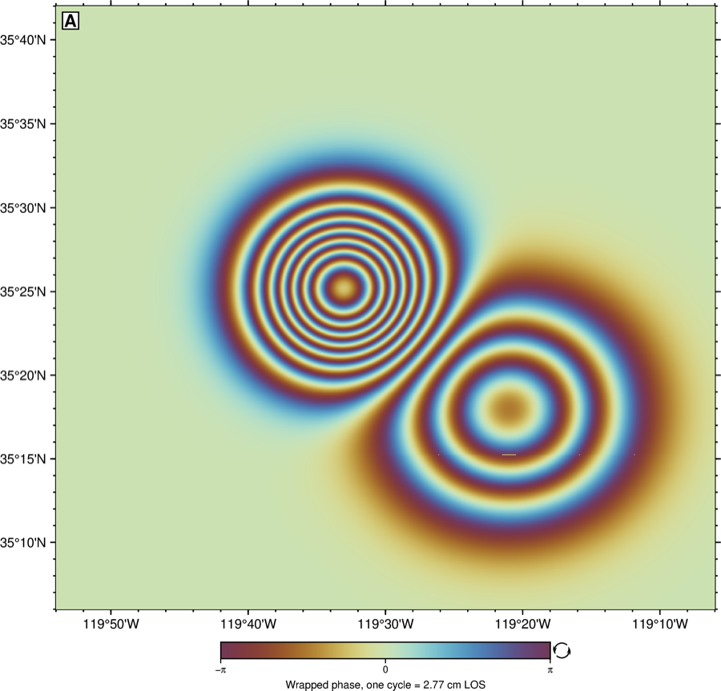
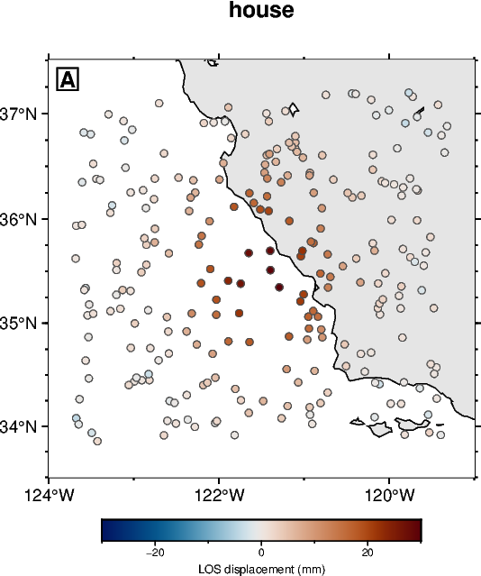
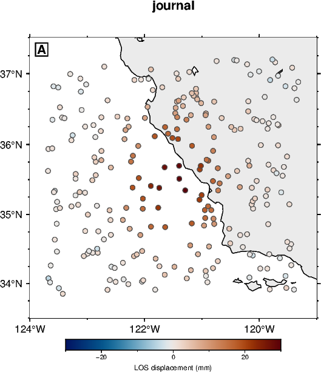
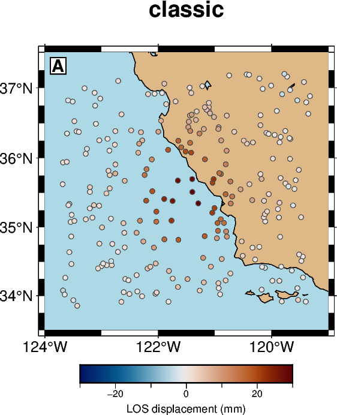
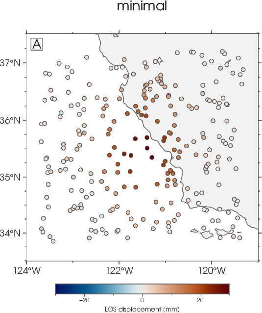
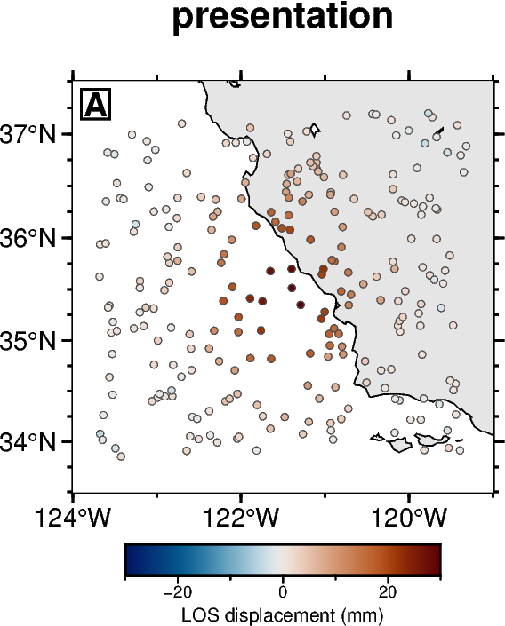
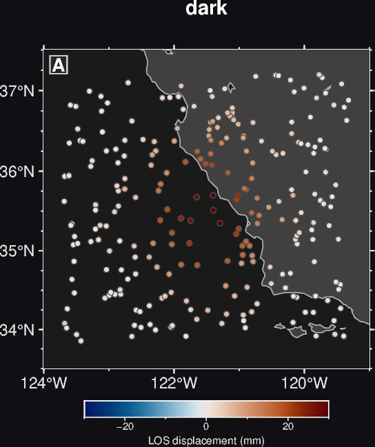

# pygmt-plotting

An [Agent Skill](https://agentskills.io/specification) for producing publication-quality
scientific maps and figures with [PyGMT](https://www.pygmt.org/).

It bundles what is usually scattered: six runnable figure templates, six switchable
visual styles, a condensed API reference, an opinionated house style for journal figures,
a mandatory pre-delivery QC loop, and — the part that took the longest to accumulate —
a catalogue of field-tested traps that the official docs do not mention. The current
version was hardened by ten rounds of blind agent testing: every checklist item and
gotcha corresponds to a failure that actually happened.

## Install

Clone it into your agent's skills directory. Note that the target directory is
`pygmt-plotting`, not the repository name — keep the skill name and the folder name in sync.

**Claude Code**

```bash
git clone https://github.com/rookieplayerjr/pygmt-plotting-skill.git ~/.claude/skills/pygmt-plotting
```

**Codex**

```bash
git clone https://github.com/rookieplayerjr/pygmt-plotting-skill.git ~/.codex/skills/pygmt-plotting
```

If `CODEX_HOME` is set, use `$CODEX_HOME/skills` instead of `~/.codex/skills`.

**Tencent WorkBuddy**

```bash
git clone https://github.com/rookieplayerjr/pygmt-plotting-skill.git ~/.workbuddy/skills/pygmt-plotting
```

All three runtimes discover the skill automatically from the `SKILL.md` frontmatter; start a
new session afterwards. The content is platform-neutral — it is reference material and
runnable Python, with no host-specific tool calls — so it works unchanged on any of them.

Rendering figures additionally requires GMT and PyGMT to be installed in whatever environment
the agent executes Python in. The reference and gotcha material is useful without them; the
four scripts are not.

No git? Download the tarball instead:

```bash
curl -L https://github.com/rookieplayerjr/pygmt-plotting-skill/archive/refs/heads/main.tar.gz | tar xz
```

Then rename the extracted `pygmt-plotting-skill-main/` folder to `pygmt-plotting` and move it
into the skills directory for your runtime.

## What's inside

| File | Contents |
|---|---|
| `SKILL.md` | Entry point: quick start, the three universal parameters (`region`/`projection`/`frame`), projection & CPT cheat sheets, and the house style rules. |
| `REFERENCE.md` | Condensed API: figure lifecycle, `coast`/`plot`/`text`, `grdimage`/`grdcontour`/`grdview`, `makecpt`/`colorbar`, grid processing, `meca`, `velo`, `project`, and multi-panel layout. |
| `GOTCHAS.md` | Nine sections of pitfalls with symptom → cause → fix, sourced from the GMT forum, PyGMT issues, and hard-won practice. |
| `CRAFT.md` | Publication craft: layer order, colormap choice, hillshade conventions, multi-panel alignment, vector vs raster export. |
| `GALLERY.md` | 13 ready-to-adapt scenario templates. |
| `STYLES.md` | Six selectable visual styles (`house` / `journal` / `classic` / `minimal` / `presentation` / `dark`) with previews and per-style guidance. |
| `QC.md` | The mandatory pre-delivery QC loop: overlap / clipping / missing-element / spurious-ink / layout checklists plus data-anchor checks, with a token-economy protocol. |
| `COMMUNITY.md` | Curated navigation of the GMT China community manual (docs.gmt-china.org): high-value gallery examples, the complete CJK-label recipe, dataset pointers. |
| `MANUAL.html` | A self-contained user handbook (Chinese, GMT-manual style) covering all of the above. |
| `scripts/` | Six runnable, parameterized templates plus `style_presets.py` (the style engine). Each runs standalone on synthetic or GMT-hosted data — edit the `CONFIG` block at the top, switch looks with one `STYLE = "..."` line. |

All six scripts are verified to run against PyGMT 0.17.0 / GMT 6.6.0. They produce the
figures below directly, with no data files to fetch:

| `displacement_map.py` | `seismicity_map.py` |
|---|---|
|  |  |
| Shaded relief under a diverging displacement field, with a horizontal colorbar. | Earthquake catalogue scaled by magnitude and colored by depth, with focal mechanisms. |

| `cross_section.py` | `multipanel_components.py` |
|---|---|
|  |  |
| A profile line on a map plus events projected onto a depth section, depth reading positive downward. | Three-component panel row sharing one CPT, laid out with `subplot`. |

| `velocity_field_map.py` | `wrapped_phase_map.py` |
|---|---|
|  |  |
| GPS velocities with 1-sigma error ellipses, a labeled reference vector, and a map scale — using the `velo` syntax that keeps arrowheads alive. | A wrapped interferogram rendered without wrap-seam artifacts: cyclic CPT, nearest-neighbor interpolation, and a moire guard on raster sizing. |

## Styles

One dataset, six looks — set `STYLE = "..."` in any template's CONFIG block:

| | | |
|---|---|---|
|  `house` — default |  `journal` — submission |  `classic` — fancy frame |
|  `minimal` — light grid |  `presentation` — slides |  `dark` — dark decks |

Every style keeps the same hard rules (W/S-only annotations, bottom colorbar with units,
positive-down depth axes); `style_presets.py` also exposes `style()`, `panel_label()`,
`colorbar()` and `coast_colors()` for standalone scripts.

## A sample of the gotchas

These are the kind of failures that cost an afternoon because nothing errors out:

- **Vector arrowheads never appear.** `style="v0.5c+gred"` draws a bare line. `+g` (fill)
  and `+h` (shape) only describe what a head looks like — `+e`/`+b` is what actually turns
  one on. Separately, a vector shorter than the head length silently loses its head
  entirely, which is why velocity fields lose arrows on exactly the small vectors you
  cared about.
- **`makecpt` without `output=` sets a session-global CPT** that the next `makecpt`
  silently overwrites, so multi-panel figures get cross-contaminated colors.
- **xarray arithmetic resets `gmt.gtype`/`gmt.registration`,** so `grid * 2` quietly turns
  a geographic grid into a Cartesian one and your map shifts. Slicing preserves them.
- **`frame=["WSne", "af", "+tTitle"]` hard-fails on GMT 6.6.** Frame settings may appear
  in only one list entry now — write `["WSne+tTitle", "af"]`. Half the older tutorials
  teach the failing form.
- **`velo` with `+n` silently deletes every arrowhead.** Paper units error out on
  geographic maps, and `+n8q` "works" while shrinking all heads to nothing. Omit `+n`
  and size `VSCALE` so your smallest meaningful velocity clears the head length.
- **Bilinear interpolation destroys cyclic colormaps.** Adjacent +π and −π pixels average
  to 0, which is the neutral color, so wrapped interferograms grow a false gray seam along
  every fringe boundary. Use `interpolation="n"`.

## House style

The skill enforces an opinionated default for journal figures: plain frames, tick labels
only on the left and bottom edges, boxed uppercase panel labels, horizontal colorbars with
units, `vik` for diverging data and `inferno`/`roma` for sequential, and depth axes that
read positive downward. Override any of it when a target journal disagrees — the rules are
stated in one place at the top of `SKILL.md` precisely so they are easy to change.

One rule is worth calling out because violating it is subtle: when imaging dense fringe or
speckle data, the rendered panel must have at least as many pixels as the grid has columns
(`panel_cm × dpi / 2.54 ≥ n_columns`). Undersampled fringes alias into moiré ripples that
look like real signal.

## Requirements

PyGMT ≥ 0.13 (developed and verified against 0.17.0) and GMT ≥ 6.4 (verified against 6.6.0).
Install via conda-forge, which is the only reliable way to keep the GMT C library and the
Python wrapper in sync:

```bash
conda install -c conda-forge pygmt
```

## License

MIT — see [LICENSE](LICENSE).
